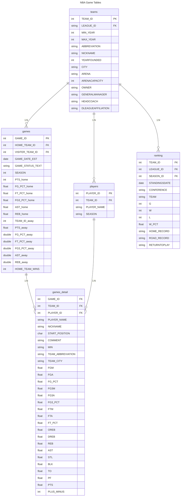

```mermaid
---
title: NBA Game Tables
---
erDiagram
    games {
        int GAME_ID PK
        int HOME_TEAM_ID FK
        int VISITER_TEAM_ID FK
        date GAME_DATE_EST
        string GAME_STATUS_TEXT
        int SEASON
        int PTS_home
        float FG_PCT_home
        float FT_PCT_home
        float FG3_PCT_home
        float AST_home
        float REB_home
        int TEAM_ID_away
        float PTS_away
        double FG_PCT_away
        double FT_PCT_away
        double FG3_PCT_away
        double AST_away
        double REB_away
        int HOME_TEAM_WINS
    }
    games_detail {
        int GAME_ID FK 
        int TEAM_ID FK 
        int PLAYER_ID FK
        string PLAYER_NAME
        string NICKNAME
        char START_POSITION
        string COMMENT
        string MIN
        string TEAM_ABBREVIATION
        string TEAM_CITY
        float FGM
        float FGA
        float FG_PCT
        float FG3M
        float FG3A
        float FG3_PCT
        float FTM
        float FTA
        float FT_PCT
        float OREB
        float DREB
        float REB
        float AST
        float STL
        float BLK
        float TO
        float PF
        float PTS
        int PLUS_MINUS
        
    }
    players {
        int PLAYER_ID PK
        int TEAM_ID FK
        string PLAYER_NAME
        string SEASON
    }
    teams {
        int TEAM_ID PK
        string LEAGUE_ID FK
        int MIN_YEAR
        int MAX_YEAR
        string ABBREVIATION
        string NICKNAME
        int YEARFOUNDED
        string CITY
        string ARENA
        int ARENACAPACITY
        string OWNER
        string GENERALMANAGER
        string HEADCOACH
        string DLEAGUEAFFILIATION
    }
    ranking {
        int TEAM_ID FK
        int LEAGUE_ID FK
        int SEASON_ID FK
        date STANDINGSDATE
        string CONFERENCE
        string TEAM
        int G
        int W
        int L
        float W_PCT
        string HOME_RECORD
        string ROAD_RECORD
        string RETURNTOPLAY
    }
    games ||--o{ games_detail : "1:N"
    teams ||--o{ players : "1:N"
    players ||--o{ games_detail : "1:N"
    teams ||--o{ ranking : "1:N"
    teams ||--o{ games : "1:N"
```